
<h1>LABORATORIUM CYBERBEZPIECZEŃSTWO</h1>

&nbsp;

&nbsp;

<centerer>
    <Ltext>Data wykonania ćwiczenia:</Ltext>
    

        <rectangle>
            <Rtext>07.10.2024</Rtext>
        </rectangle>
    

</centerer>

<centerer>
    <Ltext>Rok studiów:</Ltext>
    

        <rectangle>
            <Rtext>4</Rtext>
        </rectangle>
    

</centerer>

<centerer>
    <Ltext>Semestr:</Ltext>
    

        <rectangle>
            <Rtext>7</Rtext>
        </rectangle>
    

</centerer>

<centerer>
    <Ltext>Grupa studencka:</Ltext>
    

        <rectangle>
            <Rtext>2</Rtext>
        </rectangle>
    

</centerer>

<centerer>
    <Ltext>Grupa laboratoryjna:</Ltext>
    

        <rectangle>
            <Rtext>2B</Rtext>
        </rectangle>
    

</centerer>

&nbsp;

&nbsp;

<row>
    <b>Ćwiczenie nr.</b>
    <rectangle>
        <Rtext>1</Rtext>
    </rectangle>
</row>

&nbsp;

&nbsp;

<b>Temat: </b> Systemy bezpieczeństwa oparte na hasłach

&nbsp;

&nbsp;

<b>Osoby wykonujące ćwiczenia: </b>

1. Patryk Pawełek

&nbsp;

&nbsp;

<h1>Katedra Informatyki i Automatyki</h1>

# Sprawozdanie z realizacji zadania – Systemy bezpieczeństwa oparte na hasłach

## 1. Wprowadzenie

Hasła są podstawowym środkiem ochrony dostępu do systemów oraz informacji o charakterze poufnym. Aby skutecznie pełniły swoją rolę, wymagają odpowiedniego zarządzania, zgodnie z wytycznymi technicznymi i organizacyjnymi. Proces uwierzytelniania umożliwia weryfikację tożsamości użytkowników poprzez podanie poufnego hasła. Celem tego zadania było stworzenie systemu bezpieczeństwa zapewniającego efektywne zarządzanie użytkownikami, ich hasłami oraz zasadami ich tworzenia.

## 2. Cel zadania

Zadanie obejmowało stworzenie programu implementującego system bezpieczeństwa haseł z następującymi funkcjonalnościami:

1. Obsługa dwóch ról: administratora (ADMIN) oraz użytkownika.
2. Administrator posiada możliwość:
   - zmiany hasła,
   - dodawania, modyfikowania oraz usuwania użytkowników,
   - blokowania kont oraz włączania/wyłączania ograniczeń dotyczących haseł,
   - ustawiania ważności hasła oraz wymuszania jego zmiany po określonym czasie.
3. Zwykły użytkownik może zmieniać swoje hasło oraz wylogować się.
4. Program zawiera mechanizm logowania z weryfikacją poprawności identyfikatora i hasła.
5. Przy pierwszym logowaniu użytkownik jest proszony o zmianę hasła.
6. Program korzysta z bezpiecznego algorytmu do hashowania haseł (bcrypt).
7. System musi weryfikować spełnianie indywidualnych zasad dotyczących hasła, w moim przypadku są to znaki z kategorii: wielkie litery, małe litery, oraz znaki specjalne (sekcja 9).

## 3. Implementacja programu

### 3.1. Struktura aplikacji

Aplikacja została stworzona z wykorzystaniem frameworka React, wykorzystana została baza danych MongoDB oraz serwer jest oparty na node oraz express. Program wykorzystuje bibliotekę `bcrypt` do bezpiecznego przechowywania haseł.

### Obsługa dwóch ról: administratora (ADMIN) oraz użytkownika

Na frontendzie mamy do wykorzystania zarówno dashboard dla Admina oraz dla zwykłego Usera:

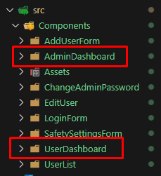

Jeśli chodzi o backend, to występują tam routes osobno dla admina oraz zwykłego usera, podobnie ma się sprawa w przypadku kontrolerów.

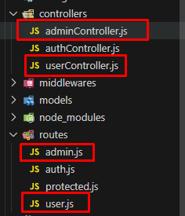

### Możliwości Administratora:

### a) Zmiana hasła:

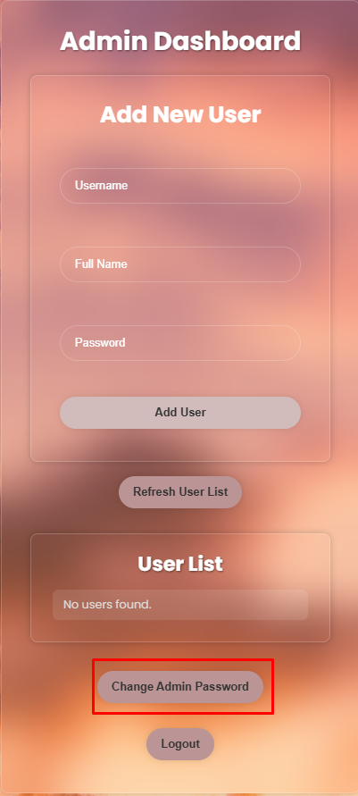

W AdminDashboard mamy możliwość zmiany hasła administratora, po kliknięciu na przycisk przenosi nas do innego komponentu gdzie możemy zmienić hasło.

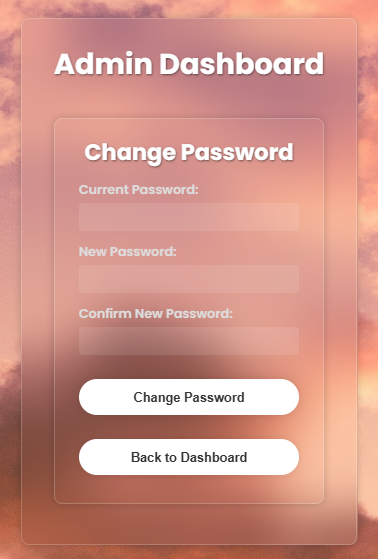

Poniżej znajduje się część kodu odpowiadająca za zmianę hasła administratora

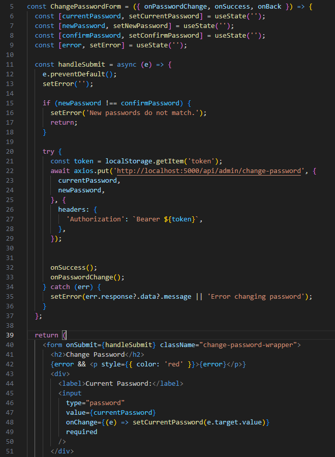

Natomiast tak wygląda kod od strony serwera: 

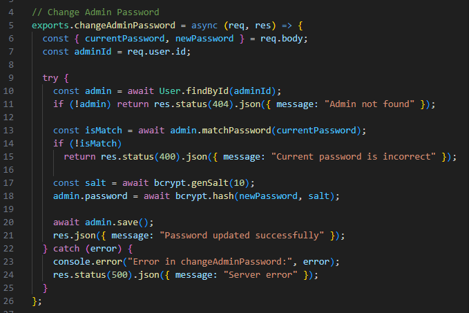

### b) Dodawanie, modyfikowanie, blokowanie oraz usuwanie użytkowników:

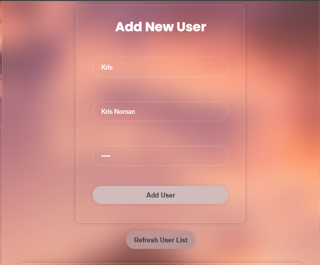
Formularz do dodawania nowych użytkowników.

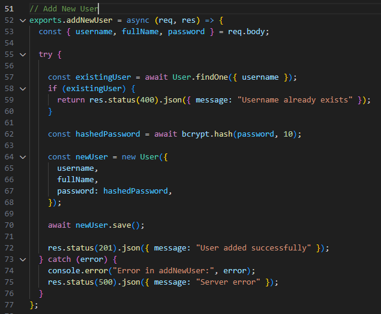

Tak to wygląda od strony kodu na serwerze.

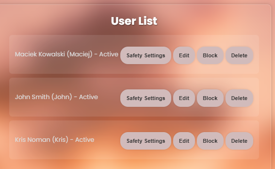

Po dodaniu kilku przykładowych użytkowników obok nich pojawiają się opcję takie jak Edit, Block, Delete oraz Safety Settings

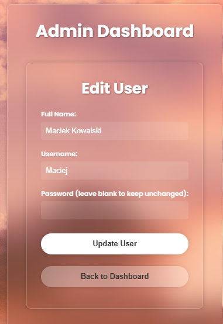

Po wybraniu opcji Edit mamy możliwość edytowania wszystkich pól użytkownika. Nazwa użytkownika, imię i nazwisko oraz hasło.

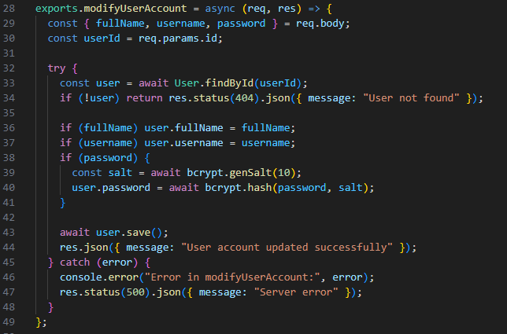

Jeśli chodzi o edycję istniejących użytkowników tak wygląda kod od strony backendu.

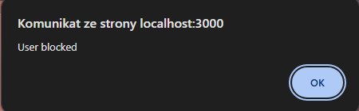

Gdy klikniemy na przycisk Block wtedy pojawi się nam komunikat o zablokowaniu użytkownika, gdy klikniemy Ok zauważymy, że status użytkownika zmienił się na blocked, oraz użytkownik nie może się zalogować do swojego konta, i wyświetla mu się komunikat, że jego konto jest zablokowane, oraz powinien skontaktować się z administratorem.

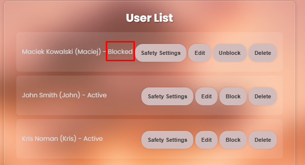

Blokowanie opiera się o 2 funkcje, jeśli chodzi o backend, jedna jest to blokowanie: 

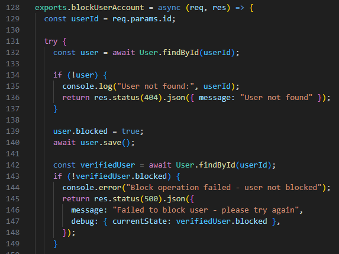

Natomiast następna to odblokowanie:

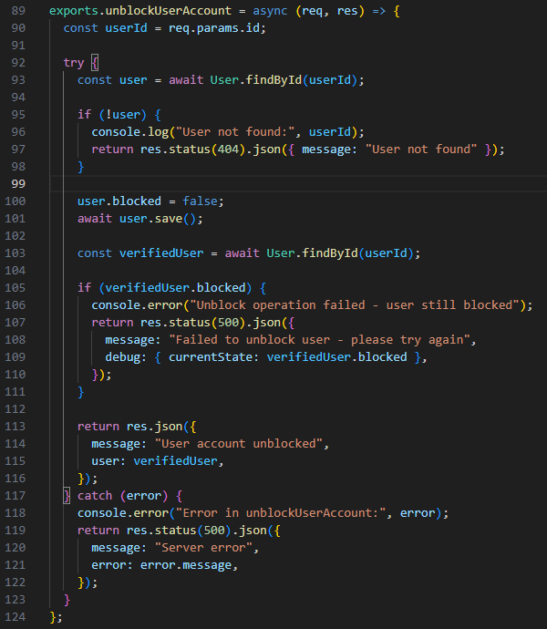

Kolejną rzeczą, którą admin jest w stanie robić z użytkownikami jest ich usuwanie. 

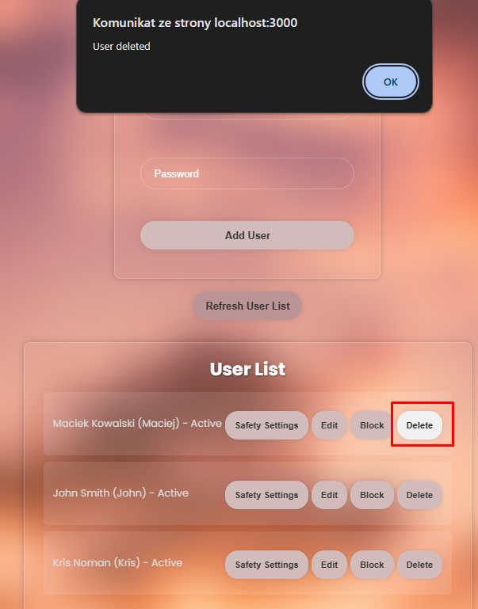

Po kliknięciu przycisku delete pojawia się nam komunikat o usunięciu użytkownika, a gdy klikniemy "OK" pokaże nam się lista użytkowników już bez tego użytkownika, który został przez nas usunięty.

Usuwanie jest obsługiwane przez prostą funkcję findByIdAndDelete

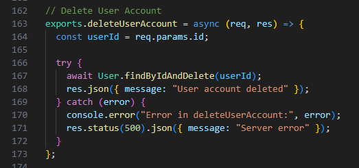

### c) Ustawianie ważności hasła oraz wymuszanie jego zmiany po określonym czasie.

Po kliknięciu na "Safety Settings", które jest dostępne obok każdego użytkownika otwiera nam się okno, w którym możemy zmienić wymagania dotyczące hasła (duże litery, małe litery oraz znaki specjalne), oraz dodatkowo czas po którym dane hasło wygasa.

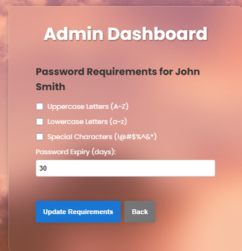

Jeśli chodzi o kod który to obsługuje:

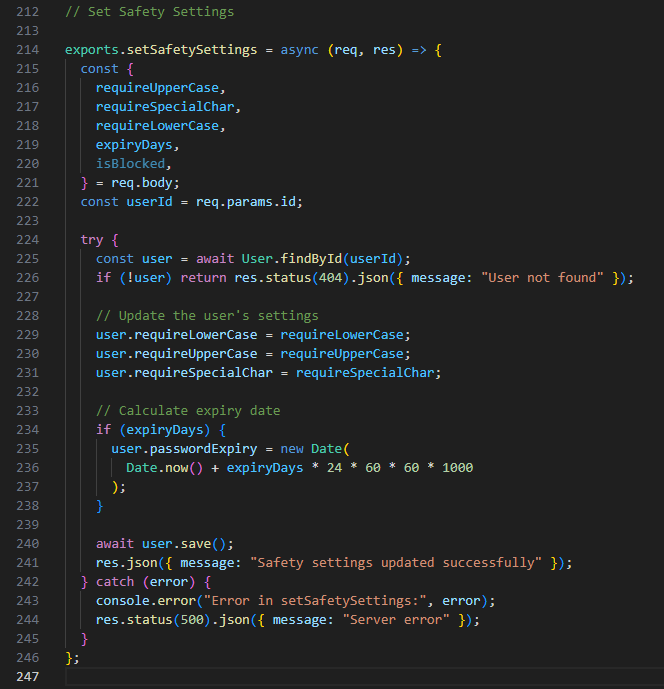

Tutaj natomiast mamy obsługę wygaszania ważności hasła:

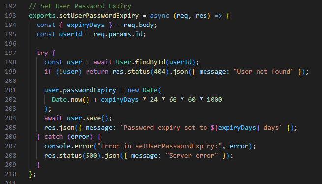

### Możliwości Użytkownika:

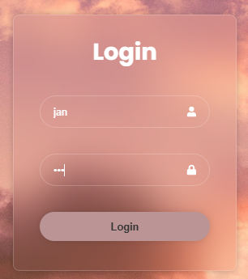

Po wpisaniu loginu oraz hasła do naszej aplikacji przeniesiemy się do UserDashboard, w którym jedyną możliwością jest możliwość zmiany hasła.

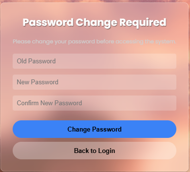

Przy pierwszym logowaniu użytkownik jest zmuszony do zmiany obecnego hasła podanego przez administratora.

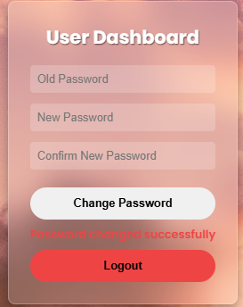

Tak wygląda UserDashboard

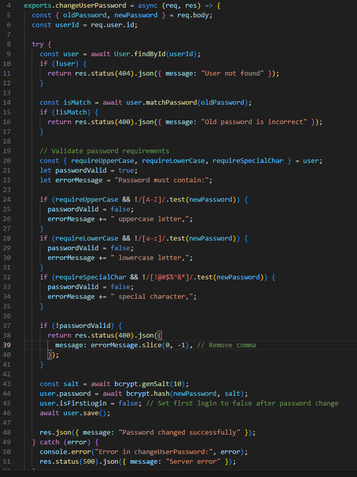

Powyżej znajduje się funkcja obsługująca zmianę hasła.

### Program zawiera mechanizm logowania z weryfikacją poprawności identyfikatora i hasła.

Gdy uruchomimy naszą aplikację widzimy tylko ekran logowania:

W przypadku podania złego hasła lub nazwy użytkownika program poinformuje nas o tym, że wpisaliśmy złe dane. Hasło jest zakryte, podczas wpisywania.

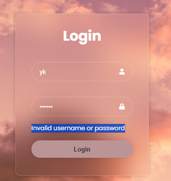

### Przy pierwszym logowaniu użytkownik jest proszony o zmianę hasła.

Po wpisaniu loginu oraz hasła do naszej aplikacji przeniesiemy się do UserDashboard, w którym jedyną możliwością jest możliwość zmiany hasła.

Przy pierwszym logowaniu użytkownik jest zmuszony do zmiany obecnego hasła podanego przez administratora.

Gdy zrobimy to poprawnie możemy przenieść się już do UserDashboard gdzie użytkownik może zmienić hasło.

### Program korzysta z bezpiecznego algorytmu do hashowania haseł (bcrypt).

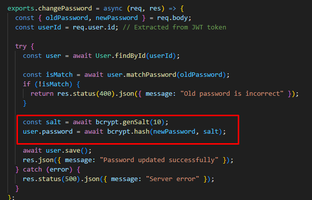

Używanie bcrypt.

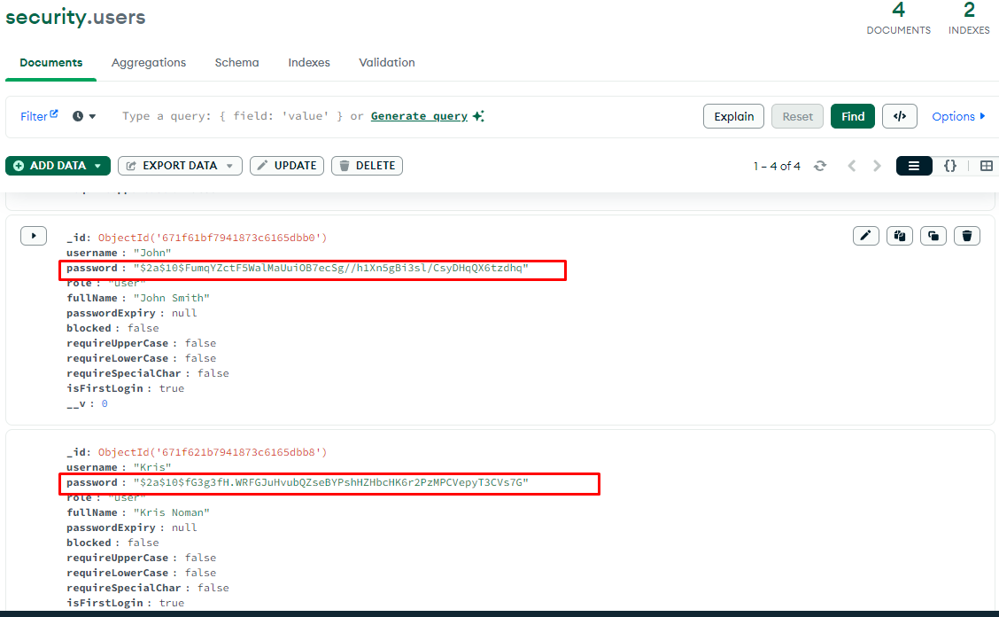

Po wejściu w bazę danych możemy zobaczyć, że dzięki temu algorytmowi nasze hasła użytkowników są bezpiecznie zaszyfrowane.

### System musi weryfikować spełnianie indywidualnych zasad dotyczących hasła, w moim przypadku są to znaki z kategorii: wielkie litery, małe litery, oraz znaki specjalne (sekcja 9).

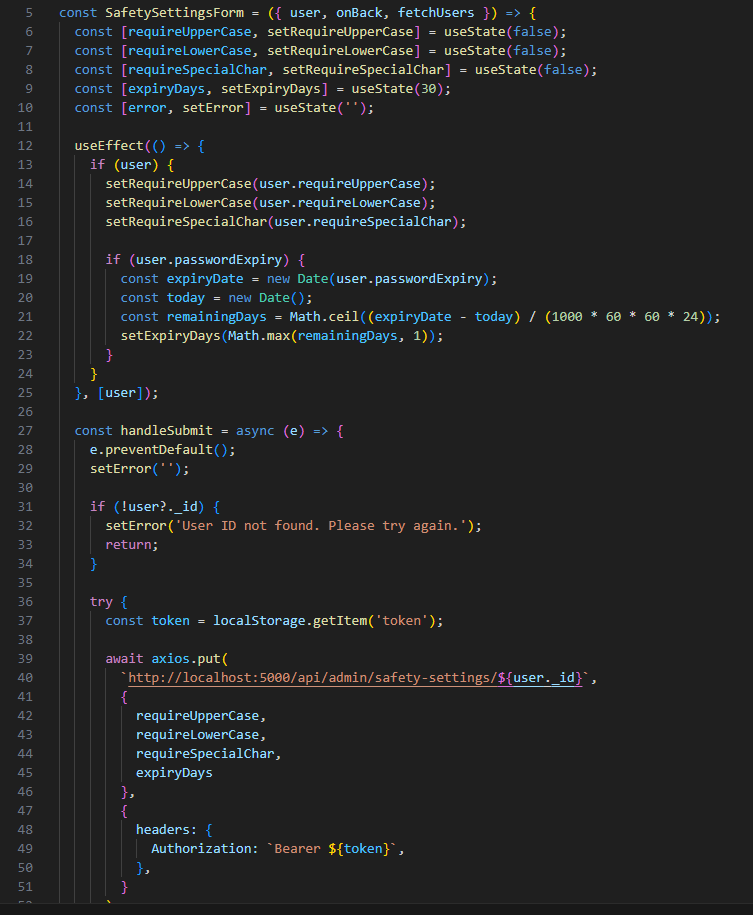

Formularz SafetySettings został przedstawiony wcześniej, zarówno jego możliwości, jak i kod od strony backendu, w związku z tym, tutaj znajduje się kod do frontendu.

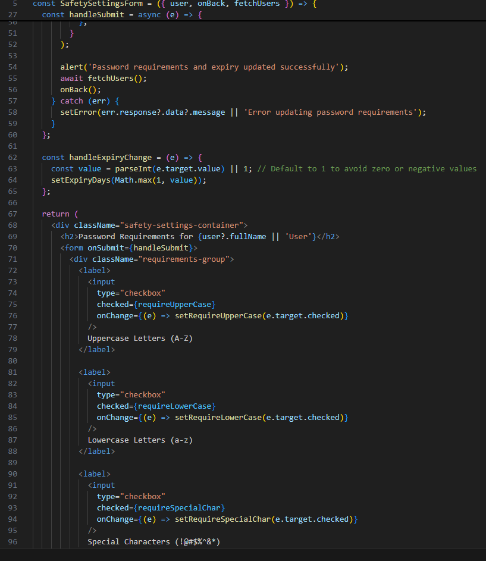

Część dalsza kodu.

### 3.2. Zarządzanie sesjami

W celu zapewnienia bezpieczeństwa i wygody użytkowania, aplikacja wykorzystuje mechanizmy zarządzania sesjami oparte na tokenach JWT, które są zapisywane w ciasteczkach. Administratorzy mają dostęp do panelu, w którym mogą zarządzać kontami użytkowników oraz polityką haseł. W ten sposób prezentuje się to od strony kodu: 

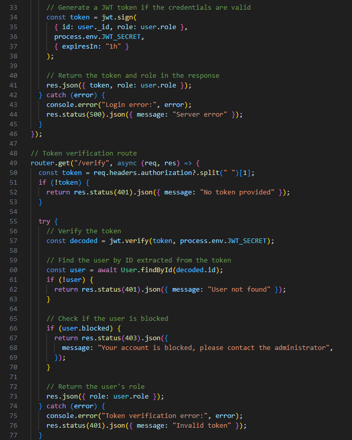

## 4. Podsumowanie

Opracowany program spełnia wszystkie wymagania projektu. Umożliwia efektywne zarządzanie kontami użytkowników, zapewnia weryfikację haseł zgodnie z ustalonymi standardami bezpieczeństwa oraz obsługę różnych ról w systemie. Wdrożenie tego rozwiązania w środowisku produkcyjnym mogłoby znacząco zwiększyć poziom bezpieczeństwa danych, dzięki rygorystycznym zasadom uwierzytelniania użytkowników.

