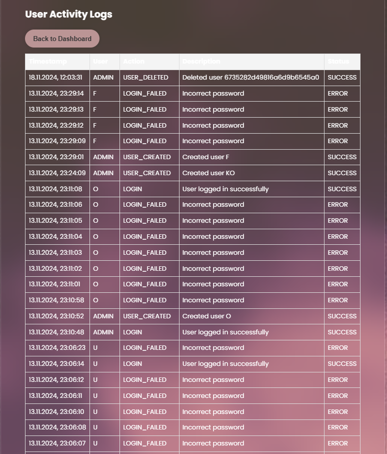
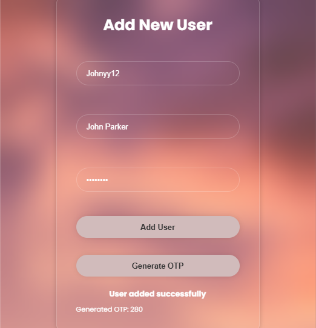
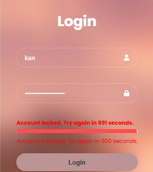

<style>
h1, h4 {
    border-bottom: 0;
    display:flex;
    flex-direction: column;
    align-items: center;
      }
      
centerer{
    display: grid;
    grid-template-columns: 6fr 1fr 4fr;
    grid-template-rows: 1fr;

}
rectangle{
    border: 1px solid black;
    margin: 0px 50px 0px 50px;
    width: 200px;
    height: 4em;
    display: flex;
    flex-direction: column;
    align-items: center;
    justify-items: center;
}
Ltext{
    margin: auto auto auto 0;
    font-weight: bold;
    margin-left: 4em
}
Rtext{
    margin: auto;
}

row {
    display: flex;
    flex-direction: row;
    align-items: center;
    justify-content: center; 
}
 </style>
<h1>LABORATORIUM CYBERBEZPIECZEŃSTWO</h1>

&nbsp;

&nbsp;

<style>

</style>

<centerer>
    <Ltext>Data wykonania ćwiczenia:</Ltext>
    <div align="center">
        <rectangle>
            <Rtext>21.10.2024</Rtext>
        </rectangle>
    </div>
</centerer>

<centerer>
    <Ltext>Rok studiów:</Ltext>
    <div align="center">
        <rectangle>
            <Rtext>4</Rtext>
        </rectangle>
    </div>
</centerer>

<centerer>
    <Ltext>Semestr:</Ltext>
    <div align="center">
        <rectangle>
            <Rtext>7</Rtext>
        </rectangle>
    </div>
</centerer>

<centerer>
    <Ltext>Grupa studencka:</Ltext>
    <div align="center">
        <rectangle>
            <Rtext>2</Rtext>
        </rectangle>
    </div>
</centerer>

<centerer>
    <Ltext>Grupa laboratoryjna:</Ltext>
    <div align="center">
        <rectangle>
            <Rtext>2B</Rtext>
        </rectangle>
    </div>
</centerer>

&nbsp;

&nbsp;

<row>
    <b>Ćwiczenie nr.</b>
    <rectangle>
        <Rtext>2</Rtext>
    </rectangle>
</row>

&nbsp;

&nbsp;

<b>Temat: </b> Mechanizmy identyfikacji, uwierzytelniania oraz autoryzacji

&nbsp;

&nbsp;

<b>Osoby wykonujące ćwiczenia: </b>

1. Patryk Pawełek

&nbsp;

&nbsp;

<h1>Katedra Informatyki i Automatyki</h1>

<div style="page-break-after: always;"></div>

### Sprawozdanie dotyczące implementacji systemu kontroli dostępu

#### 1. **Wprowadzenie**

Współczesne środowisko informatyczne wymaga skutecznych zabezpieczeń dostępu do systemów, aby chronić dane oraz zapewnić niezawodność procesów. Celem tego zadania jest przedstawienie realizacji systemu kontroli dostępu, który przeciwdziała nieuprawnionemu dostępowi poprzez zastosowanie funkcji jednostronnych oraz monitorowanie działań użytkowników.

System oferuje możliwość weryfikacji tożsamości użytkowników, zarządzania ich uprawnieniami oraz śledzenia operacji wykonywanych na platformie. Kluczowe jest zastosowanie funkcji jednostronnych, które gwarantują bezpieczne przechowywanie haseł. Wprowadzono również dodatkowe mechanizmy, takie jak jednorazowe hasła, limity nieudanych prób logowania oraz automatyczne wylogowanie po określonym czasie bezczynności, co jeszcze bardziej wzmacnia ochronę przed nieautoryzowanym dostępem.

#### 2. **Zadanie do zrealizowania**

Zadaniem było stworzenie aplikacji webowej, która umożliwia:

1. **Monitorowanie aktywności użytkowników**, takich jak logowanie, wylogowanie, tworzenie i usuwanie kont użytkowników, zmiana haseł oraz nadawanie lub odbieranie uprawnień. Dla każdej akcji system rejestruje nazwę użytkownika, datę oraz czas zdarzenia, a także opis akcji (czy zakończyła się sukcesem czy porażką).
2. **Zarządzanie użytkownikami i ich uprawnieniami przez administratora**, w tym:
   - Generowanie haseł jednorazowych dla nowo tworzonych użytkowników lub podczas edycji istniejących kont. W tym celu zastosowano funkcje jednokierunkowe (np. `bcrypt`) zapewniające bezpieczeństwo przechowywania haseł.
   - Przeglądanie logów aktywności wszystkich użytkowników.
   - Ustalanie limitu nieudanych prób logowania, po przekroczeniu którego konto użytkownika zostanie tymczasowo zablokowane (na okres 15 minut).
   - Wylogowanie użytkownika po upływie ustalonego czasu bezczynności.

#### 3. **Opis implementacji systemu**

##### 3.1 **System uwierzytelniania**

Podstawową funkcjonalnością aplikacji jest proces uwierzytelniania użytkownika:

1. **Logowanie użytkownika**: Użytkownik wprowadza swoje dane uwierzytelniające (identyfikator oraz hasło). Dane te są weryfikowane na podstawie zaszyfrowanych haseł przechowywanych w bazie.
2. **Weryfikacja haseł**: Admin ma dodatkową opcję dodania hasła jednorazowego do konta, dzięki czemu zapewniamy dodatkową warstwę bezpieczeństwa. W przypadku hasła jednorazowego system sprawdza poprawność hasła i oznacza je jako wykorzystane, co uniemożliwia jego ponowne użycie.
3. **Generowanie i przechowywanie haseł**: Wszystkie hasła są przechowywane w postaci skrótów (`hash`), co zapewnia bezpieczeństwo w przypadku potencjalnego wycieku danych.


##### 3.2 **Zarządzanie użytkownikami**

System pozwala administratorowi na:

- **Tworzenie nowego użytkownika** wraz z przypisaniem odpowiednich ról (np. `admin`, `user`) oraz generowaniem jednorazowego hasła w przypadku takiej potrzeby.
- **Usuwanie użytkowników** oraz edytowanie ich ról i uprawnień.
- **Logowanie zmian** dotyczących tworzenia, edytowania oraz usuwania użytkowników.

##### 3.3 **Monitorowanie i logowanie aktywności**

Każda akcja w systemie jest monitorowana i zapisywana w dzienniku aktywności. Logi obejmują:

- Datę oraz godzinę zdarzenia.
- Nazwę użytkownika
- Opis akcji, czy zakończyła się sukcesem, czy wystąpił błąd (np. niepoprawne hasło).

Dodatkowo wprowadzono możliwość przeglądania logów przez administratora, co umożliwia weryfikację poprawności działań użytkowników i identyfikację potencjalnych zagrożeń.



odpowiada za to logger, który loguje każdą ważniejszą akcję użytkownika.


```
const ActivityLog = require("../models/ActivityLog");

const logActivity = async (username, action, description, status = {}) => {
  try {
    const log = new ActivityLog({
      username,
      action,
      description,
      status,
    });
    await log.save();
  } catch (error) {
    console.error("Error logging activity:", error);
  }
};

module.exports = { logActivity };
```


##### 3.4 **Bezpieczeństwo systemu**

W celu zwiększenia bezpieczeństwa systemu zaimplementowano następujące mechanizmy:

- **Hasło Jednorazowe**:  




Tak wygląda funkcja do tworzenia hasła jednorazowego, używając funkcji tg(a*x): 

```
const generateOTP = async () => {
  const a = 0.5; 
  const x = Math.floor(100 + Math.random() * 900); // a 3-digit random number
  const otpValue = Math.tan(a * x).toString(); // Calculate tg(a * x)

  const hashedOTP = await bcrypt.hash(otpValue, 10);

  return { otp: x, hashedOTP };
};
```

- **Limit nieudanych logowań**: Po określonej liczbie błędnych prób logowania (w tym wypadku 5) konto użytkownika jest tymczasowo blokowane na 900 sekund czyli 15 minut, pojawia się dla użytkownika pasek postępu, który pokazuje ile czasu zostało do końca blokady.



Jak widać w kodzie, w wypadku gdy user poda poprawne hasło, zmienna failedLoginAttempts jest resetowana, dzięki czemu od nowa ma 5 prób zalogowania przed zablokowaniem konta. 

```
const MAX_FAILED_ATTEMPTS = 5;
const LOCKOUT_DURATION = 15 * 60 * 1000; 

exports.login = async (req, res) => {
  const { username, password } = req.body;

  try {
    const user = await User.findOne({ username });

    if (!user) {
      logger.error(`Login failed for ${username}`);
      return res.status(401).json({ message: "Invalid username or password" });
    }

    // Check if the user is locked
    if (user.isLocked) {
      const remainingTime = Math.ceil((user.lockUntil - Date.now()) / 1000); // in seconds
      logger.warn(`Locked account attempt for ${username}`);
      return res.status(403).json({
        message: `Account is locked. Try again in ${remainingTime} seconds.`,
        lockout: true,
        remainingTime,
      });
    }

    if (user.blocked) {
      logger.error(`Login failed for ${username}: Account is blocked`);
      return res.status(401).json({ message: "Invalid username or password" });
    }

    const isMatch = await user.matchPassword(password);
    if (!isMatch) {
      user.failedLoginAttempts += 1;
      logger.error(`Login failed for ${username}: Incorrect password`);

      if (user.failedLoginAttempts >= MAX_FAILED_ATTEMPTS) {
        // Correctly set lockUntil as a Date object
        user.lockUntil = new Date(Date.now() + LOCKOUT_DURATION);
        logger.warn(
          `User ${username} has been locked out until ${user.lockUntil}`
        );
        await logActivity(
          username,
          "LOGIN_LOCKED",
          `User locked out until ${user.lockUntil}`,
          "ERROR"
        );
      } else {
        await logActivity(
          username,
          "LOGIN_FAILED",
          "Incorrect password",
          "ERROR"
        );
      }

      await user.save();
      return res.status(401).json({ message: "Invalid username or password" });
    }

    user.failedLoginAttempts = 0;
    user.lockUntil = null;
    await user.save();
```

- **Wylogowanie po bezczynności**: Użytkownik zostaje automatycznie wylogowany po upływie określonego czasu bezczynności, w tym wypadku jest to 15 minute, co zapobiega nieautoryzowanemu dostępowi w przypadku pozostawienia sesji bez nadzoru.

```
const User = require("../models/User");

const sessionTimeout = async (req, res, next) => {
  const userId = req.user.id;
  const currentTime = Date.now();

  try {
    const user = await User.findById(userId);
    if (!user) return next();

    const sessionTimeoutDuration =
      user.sessionTimeoutDuration || 15 * 60 * 1000; // 15min

    // Initialize `lastActive` if it doesn't exist
    if (!req.session.lastActive) {
      req.session.lastActive = currentTime;
    }

    if (currentTime - req.session.lastActive > sessionTimeoutDuration) {
      console.log("Session expired due to inactivity for user:", userId);
      req.session.destroy((err) => {
        if (err) return res.status(500).send("Error ending session");
        return res.status(401).json({ message: "Session timed out" });
      });
    } else {
      req.session.lastActive = currentTime; // Update the last active time
      next();
    }
  } catch (error) {
    console.error("Error in session timeout middleware:", error);
    next();
  }
};

module.exports = sessionTimeout;
```

#### 4. **Podsumowanie**


System kontroli dostępu został wdrożony z naciskiem na bezpieczeństwo i funkcjonalność. Zastosowanie funkcji jednokierunkowych gwarantuje wysoki poziom zabezpieczenia przechowywanych haseł, a moduł monitorowania aktywności użytkowników pozwala administratorom na pełną kontrolę nad działaniami w systemie.

System zaprojektowano z myślą o elastycznym zarządzaniu użytkownikami oraz prostym konfigurowaniu polityk bezpieczeństwa, takich jak ograniczenia dotyczące liczby logowań i czas trwania sesji. Dzięki wdrożonym rozwiązaniom system zapewnia skuteczną ochronę przed nieautoryzowanymi próbami dostępu, jednocześnie umożliwiając administratorom łatwe zarządzanie i dostosowywanie ustawień bezpieczeństwa.

**Wnioski**:

- Wykorzystanie funkcji jednokierunkowych, takich jak bcrypt, gwarantuje, że hasła użytkowników są przechowywane w sposób bezpieczny i trudny do odczytania przez osoby nieuprawnione.
- Stałe monitorowanie działań użytkowników umożliwia szybkie wykrywanie i reagowanie na niepożądane aktywności, co zwiększa poziom zabezpieczeń systemu.
- Funkcje kontrolne i zabezpieczenia systemowe umożliwiają administratorom proaktywne zarządzanie ryzykiem, co minimalizuje zagrożenia i zwiększa stabilność działania platformy.