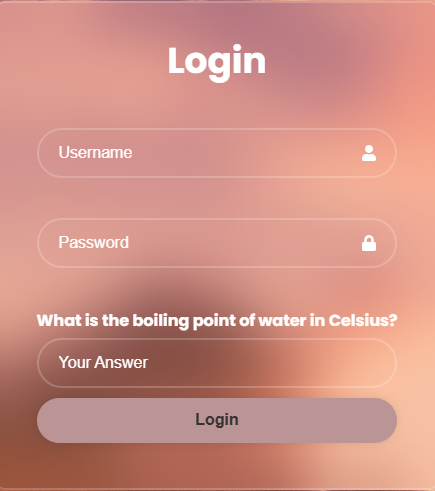
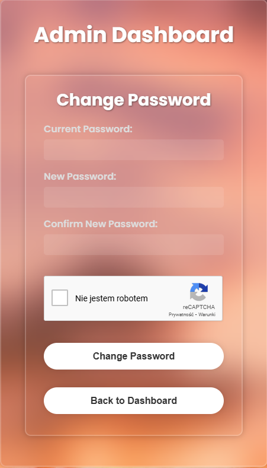

<style>
h1, h4 {
    border-bottom: 0;
    display:flex;
    flex-direction: column;
    align-items: center;
      }
      
centerer{
    display: grid;
    grid-template-columns: 6fr 1fr 4fr;
    grid-template-rows: 1fr;

}
rectangle{
    border: 1px solid black;
    margin: 0px 50px 0px 50px;
    width: 200px;
    height: 4em;
    display: flex;
    flex-direction: column;
    align-items: center;
    justify-items: center;
}
Ltext{
    margin: auto auto auto 0;
    font-weight: bold;
    margin-left: 4em
}
Rtext{
    margin: auto;
}

row {
    display: flex;
    flex-direction: row;
    align-items: center;
    justify-content: center; 
}
 </style>
<h1>LABORATORIUM CYBERBEZPIECZEŃSTWO</h1>

&nbsp;

&nbsp;

<style>

</style>

<centerer>
    <Ltext>Data wykonania ćwiczenia:</Ltext>
    <div align="center">
        <rectangle>
            <Rtext>18.11.2024</Rtext>
        </rectangle>
    </div>
</centerer>

<centerer>
    <Ltext>Rok studiów:</Ltext>
    <div align="center">
        <rectangle>
            <Rtext>4</Rtext>
        </rectangle>
    </div>
</centerer>

<centerer>
    <Ltext>Semestr:</Ltext>
    <div align="center">
        <rectangle>
            <Rtext>7</Rtext>
        </rectangle>
    </div>
</centerer>

<centerer>
    <Ltext>Grupa studencka:</Ltext>
    <div align="center">
        <rectangle>
            <Rtext>2</Rtext>
        </rectangle>
    </div>
</centerer>

<centerer>
    <Ltext>Grupa laboratoryjna:</Ltext>
    <div align="center">
        <rectangle>
            <Rtext>2B</Rtext>
        </rectangle>
    </div>
</centerer>

&nbsp;

&nbsp;

<row>
    <b>Ćwiczenie nr.</b>
    <rectangle>
        <Rtext>3</Rtext>
    </rectangle>
</row>

&nbsp;

&nbsp;

<b>Temat: </b> Ochrona przed botami, spamem i wprowadzaniem niepożądanych treści

&nbsp;

&nbsp;

<b>Osoby wykonujące ćwiczenia: </b>

1. Patryk Pawełek

&nbsp;

&nbsp;

<h1>Katedra Informatyki i Automatyki</h1>

<div style="page-break-after: always;"></div>

### Sprawozdanie na temat zabezpieczeń CAPTCHA i Google reCAPTCHA

#### 1. **Wprowadzenie**

Wraz z postępem technologicznym strony internetowe i aplikacje muszą stawiać czoła coraz większej liczbie zagrożeń wynikających z działań automatycznych botów. Chociaż nie wszystkie z tych działań są bezpośrednio szkodliwe, mogą znacząco zakłócać prawidłowe funkcjonowanie serwisów. Jednym z najczęściej stosowanych rozwiązań w celu ochrony przed botami jest CAPTCHA (Completely Automated Public Turing test to tell Computers and Humans Apart), które umożliwia rozróżnienie użytkowników od maszyn.

Podczas laboratorium zadaniem było wdrożenie systemów CAPTCHA oraz Google reCAPTCHA w aplikacji internetowej, mających na celu zabezpieczenie formularzy logowania i zmiany hasła przed atakami zautomatyzowanych botów.

#### 2. **Zadanie do zrealizowania**

Zadaniem było stworzenie zaimplementowanie następujących mechanizmów:

1. **Implementacja mechanizmu CAPTCHA przy logowaniu** W celu ochrony przed botami przy logowaniu, zastosowano klasyczny system CAPTCHA, który wyświetla
użytkownikowi pytanie (np. "What's the capital of Great Britain"), na które użytkownik musi poprawnie
odpowiedzieć.



Użytkownik poza podaniem hasła oraz loginu musi odpowiedzieć na jedno z losowo wybranych pytań 

```
const jwt = require("jsonwebtoken");

const captchaList = [
  { question: "What is the capital of the United Kingdom?", answer: "London" },
  { question: "What is 5 plus 7?", answer: "12" },
  {
    question: "What color do you get when you mix red and white?",
    answer: "Pink",
  },
  {
    question: "What is the largest planet in our Solar System?",
    answer: "Jupiter",
  },
  {
    question: "In which continent is the Sahara Desert located?",
    answer: "Africa",
  },
  { question: "What is the square root of 64?", answer: "8" },
  { question: "What is the primary color of the sun?", answer: "Yellow" },
  {
    question: "What is the name of the famous ship that sank in 1912?",
    answer: "Titanic",
  },
  { question: "How many legs does a spider have?", answer: "8" },
  { question: "What is the boiling point of water in Celsius?", answer: "100" },
  { question: "What is the opposite of 'cold'?", answer: "Hot" },
  { question: "What is 15 divided by 3?", answer: "5" },
  {
    question: "What is the first letter of the English alphabet?",
    answer: "A",
  },
  { question: "What is the smallest prime number?", answer: "2" },
  { question: "What is the color of grass?", answer: "Green" },
];

// Function to select a random CAPTCHA
const getRandomCaptcha = () => {
  const index = Math.floor(Math.random() * captchaList.length);
  return captchaList[index];
};

// Controller to serve a CAPTCHA question
exports.getCaptcha = (req, res) => {
  const captcha = getRandomCaptcha();
  const captchaToken = jwt.sign(
    { answer: captcha.answer.toLowerCase() },
    process.env.CAPTCHA_SECRET,
    { expiresIn: "5m" } // CAPTCHA valid for 5 minutes
  );

  res.json({
    question: captcha.question,
    captchaToken,
  });
};
```


Jak widać powyżej zostało zaimplementowanych 15 przykładowych pytań, gdzie niżej jest funkcja która wybiera losowo jedno z tych pytań dla użytkownika, oraz funkcja, która wyświetla użytkownikowi to pytanie w panelu logowania.


W przypadku niepoprawnego podania odpowiedzi do CAPTCHY pojawia się komunikat o niepoprawnej odpowiedzi, oraz od razu pojawia się inne pytanie

Jeśli chodzi o zaimplementowanie tego w logice logowania to poniżej znajduje się kod:
Należy pamiętać, że w przypadku tej aplikacji token CAPTCHY jest ważny tylko 5 minut, po podaniu poprawnej odpowiedzi.

```

exports.login = async (req, res) => {
  const { username, password, captchaAnswer, captchaToken } = req.body;

  // Ensure all required fields are present
  if (!username || !password || !captchaAnswer || !captchaToken) {
    return res.status(400).json({ message: "All fields are required" });
  }

  try {
    // Verify CAPTCHA token
    let decodedCaptcha;
    try {
      decodedCaptcha = jwtCaptcha.verify(
        captchaToken,
        process.env.CAPTCHA_SECRET
      );
    } catch (err) {
      logger.error(
        `CAPTCHA verification failed for ${username}: ${err.message}`
      );
      return res.status(400).json({ message: "Invalid or expired CAPTCHA" });
    }

    // Compare CAPTCHA answer
    if (captchaAnswer.trim().toLowerCase() !== decodedCaptcha.answer) {
      logger.error(`CAPTCHA answer incorrect for ${username}`);
      await logActivity(
        username,
        "CAPTCHA_FAILED",
        "Incorrect CAPTCHA answer",
        "ERROR"
      );
      return res.status(400).json({ message: "Incorrect CAPTCHA answer" });
    }

```

Poprawne podanie nazwy użytkownika, hasła, oraz odpowiedzi na CAPTCHE, umożliwia użytkownikowi zalogowanie się do systemu.


2. **Implementacja mechanizmu RECAPTCHA przy zmianie hasła**


Z kolei przy zmianie hasła użyto systemu Google reCAPTCHA, który jest bardziej zaawansowaną wersją
zabezpieczenia, wymagającą od użytkownika wykonania prostych testów weryfikujących, czy jest on
człowiekiem, czy botem. Google reCAPTCHA zostało dodane do formularza zmiany hasła zarówno administratora jak i użytkownika w celu
zabezpieczenia przed atakami botów, które mogą próbować zautomatyzować proces resetowania haseł.


Jak widać w panelu administratora, gdy przejdziemy do okienka zmiana hasła administratora, oprócz podania obecnego hasła, i nowego oraz jego potwierdzenia, musimy także zadbać o to, żeby zaznaczyć okienko RECAPTCHA, jeżeli tego nie zrobimy zostaniemy powiadomieni o tym, żeby udowodnić, że jesteśmy ludźmi a nie botem


Analogicznie wygląda sytuacja w przypadku panelu użytkownika.

```
const RECAPTCHA_SECRET_KEY = process.env.RECAPTCHA_SECRET_KEY;

exports.changeAdminPassword = async (req, res) => {
  const { currentPassword, newPassword, recaptchaToken } = req.body;
  const adminId = req.user.id;

  // Check if reCAPTCHA token is present
  if (!recaptchaToken) {
    logger.error(`reCAPTCHA token missing for admin ID ${adminId}`);
    return res
      .status(400)
      .json({ message: "reCAPTCHA verification failed. Token missing." });
  }

  console.log("RECAPTCHA_SECRET_KEY:", RECAPTCHA_SECRET_KEY); // Verify secret key loading
  console.log("Received reCAPTCHA Token in Backend:", recaptchaToken); // Confirm token is received

  try {
    // Verify reCAPTCHA token with Google
    const verificationURL = `https://www.google.com/recaptcha/api/siteverify`;

    const params = new URLSearchParams();
    params.append("secret", RECAPTCHA_SECRET_KEY);
    params.append("response", recaptchaToken);
    // Optionally, include 'remoteip'
    // params.append('remoteip', req.ip);

    const response = await axios.post(verificationURL, params.toString(), {
      headers: {
        "Content-Type": "application/x-www-form-urlencoded",
      },
    });

    console.log("reCAPTCHA Verification Response:", response.data); // Log the response

    const { success, "error-codes": errorCodes } = response.data;

    if (!success) {
      logger.error(
        `reCAPTCHA verification failed for admin ID ${adminId}: ${errorCodes}, response: ${JSON.stringify(
          response.data
        )}`
      );
      return res
        .status(400)
        .json({ message: "reCAPTCHA verification failed.", errorCodes });
    }
    ```

    

```
<div className="recaptcha-container">
        <ReCAPTCHA
          ref={recaptchaRef}
          sitekey="6LdgvYMqAAAAACyk1kT0FuE6ApzrV0DdxAd1DfWP" // Replace with your actual Site Key
          onChange={handleRecaptchaChange}
          onErrored={handleRecaptchaError}
        />

Powyżej znajduje się kod, który odpowiada za implementacje RECAPTCHA


#### 3. **Podsumowanie**


Implementacja mechanizmów CAPTCHA oraz Google reCAPTCHA w aplikacji internetowej znacząco podnosi poziom ochrony przed automatycznymi atakami botów. CAPTCHA w procesie logowania wymaga od użytkownika rozwiązania prostego zadania, co skutecznie uniemożliwia botom przeprowadzanie prób logowania. Natomiast Google reCAPTCHA stosowane podczas zmiany hasła zabezpiecza przed nieautoryzowanymi próbami tej operacji, wymuszając dodatkową weryfikację tożsamości użytkownika.

Tego rodzaju rozwiązania efektywnie redukują ryzyko ataków typu brute-force, spamu czy przejęcia konta, jednocześnie dbając o wygodę użytkowników i zwiększając bezpieczeństwo aplikacji.